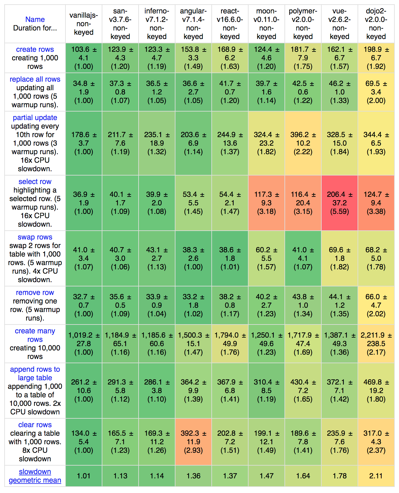
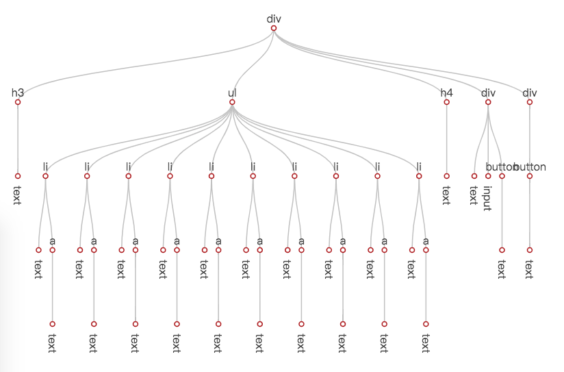
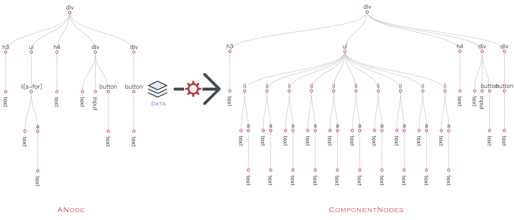
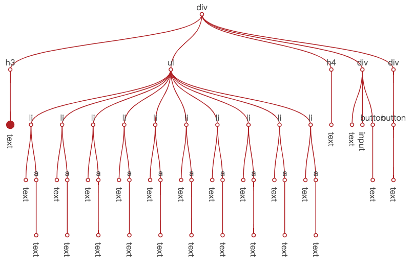
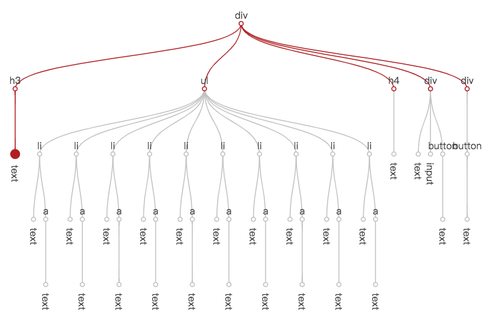
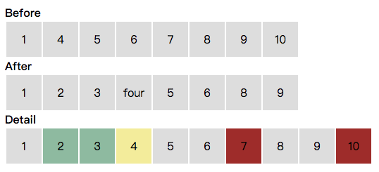
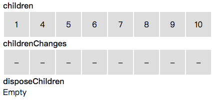
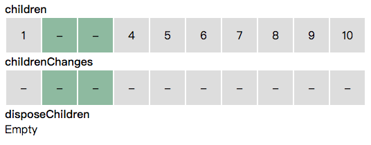
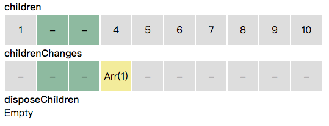
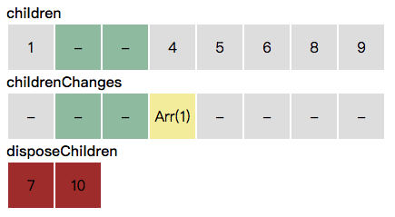

# San 为什么会这么快

> 一个 MVVM 框架的性能进化之路


性能一直是 [框架选型](https://medium.freecodecamp.org/the-12-things-you-need-to-consider-when-evaluating-any-new-javascript-library-3908c4ed3f49) 最重要的考虑因素之一。[San](https://baidu.github.io/san/) 从设计之初就希望不要因为自身的短板（性能、体积、兼容性等）而成为开发者为难的理由，所以我们在性能上投入了很多的关注和精力，效果至少在从现在看来，还不错。





将近 2 年以前，我发了一篇 [San - 一个传统的MVVM组件框架](https://efe.baidu.com/blog/san-a-traditional-mvvm-component-framework/)。对 [San](https://baidu.github.io/san/) 设计初衷感兴趣的同学可以翻翻。我一直觉得框架选型的时候，了解它的调性是非常关键的一点。


不过其实，大多数应用场景的框架选型中，**知名度** 是最主要的考虑因素，因为 **知名度** 意味着你可以找到更多的人探讨、可以找到更多周边、可以更容易招聘熟手或者以后自己找工作更有优势。所以本文的目的并不是将你从三大阵营（[React](https://reactjs.org/)、[Vue](https://vuejs.org/)、[Angular](https://angular.io/)）拉出来，而是想把 [San](https://github.com/baidu/san/) 的性能经验分享给你。这些经验无论在应用开发，还是写一些基础的东西，应该会有所帮助。


在正式开始之前，惯性先厚脸皮求下 [Star](https://github.com/baidu/san/)。


## 视图创建


考虑下面这个还算简单的组件：

```js
const MyApp = san.defineComponent({
    template: `
        <div>
            <h3>{{title}}</h3>
            <ul>
                <li s-for="item,i in list">{{item}} <a on-click="removeItem(i)">x</a></li>
            </ul>
            <h4>Operation</h4>
            <div>
                Name:
                <input type="text" value="{=value=}">
                <button on-click="addItem">add</button>
            </div>
            <div>
                <button on-click="reset">reset</button>
            </div>
        </div>
    `,

    initData() {
        return {
            title: 'List',
            list: []
        };
    },

    addItem() {
        this.data.push('list', this.data.get('value'));
        this.data.set('value', '');
    },

    removeItem(index) {
        this.data.removeAt('list', index);
    },

    reset() {
        this.data.set('list', []);
    }
});
```

在视图初次渲染完成后，[San](https://github.com/baidu/san/) 会生成一棵这样子的树：




那么，在这个过程里，[San](https://github.com/baidu/san/) 都做了哪些事情呢？


### 模板解析

在组件第一个实例被创建时，**template** 属性会被解析成 [ANode](https://github.com/baidu/san/blob/master/doc/anode.md)。


[ANode](https://github.com/baidu/san/blob/master/doc/anode.md) 的含义是抽象节点树，包含了模板声明的所有信息，包括标签、文本、插值、数据绑定、条件、循环、事件等信息。对每个数据引用的声明，也会解析出具体的表达式对象。


```json
{
    "directives": {},
    "props": [],
    "events": [],
    "children": [
        {
            "directives": {
                "for": {
                    "item": "item",
                    "value": {
                        "type": 4,
                        "paths": [
                            {
                                "type": 1,
                                "value": "list"
                            }
                        ]
                    },
                    "index": "i",
                    "raw": "item,i in list"
                }
            },
            "props": [],
            "events": [],
            "children": [
                {
                    "textExpr": {
                        "type": 7,
                        "segs": [
                            {
                                "type": 5,
                                "expr": {
                                    "type": 4,
                                    "paths": [
                                        {
                                            "type": 1,
                                            "value": "item"
                                        }
                                    ]
                                },
                                "filters": [],
                                "raw": "item"
                            }
                        ]
                    }
                },
                {
                    "directives": {},
                    "props": [],
                    "events": [
                        {
                            "name": "click",
                            "modifier": {},
                            "expr": {
                                "type": 6,
                                "name": {
                                    "type": 4,
                                    "paths": [
                                        {
                                            "type": 1,
                                            "value": "removeItem"
                                        }
                                    ]
                                },
                                "args": [
                                    {
                                        "type": 4,
                                        "paths": [
                                            {
                                                "type": 1,
                                                "value": "i"
                                            }
                                        ]
                                    }
                                ],
                                "raw": "removeItem(i)"
                            }
                        }
                    ],
                    "children": [
                        {
                            "textExpr": {
                                "type": 7,
                                "segs": [
                                    {
                                        "type": 1,
                                        "literal": "x",
                                        "value": "x"
                                    }
                                ],
                                "value": "x"
                            }
                        }
                    ],
                    "tagName": "a"
                }
            ],
            "tagName": "li"
        }
    ],
    "tagName": "ul"
}
```

[ANode](https://github.com/baidu/san/blob/master/doc/anode.md) 保存着视图声明的数据引用与事件绑定信息，在视图的初次渲染与后续的视图更新中，都扮演着不可或缺的作用。

无论一个组件被创建了多少个实例，**template** 的解析都只会进行一次。当然，预编译是可以做的。但因为 **template** 是用才解析，没有被使用的组件不会解析，所以就看实际使用中值不值，有没有必要了。


### preheat

在组件第一个实例被创建时，[ANode](https://github.com/baidu/san/blob/master/doc/anode.md) 会进行一个 **预热** 操作。看起来， **预热** 和 **template解析** 都是发生在第一个实例创建时，那他们有什么区别呢？

1. **template解析** 生成的 [ANode](https://github.com/baidu/san/blob/master/doc/anode.md) 是一个可以被 JSON stringify 的对象。
2. 由于 1，所以 [ANode](https://github.com/baidu/san/blob/master/doc/anode.md) 可以进行预编译。这种情况下，**template解析** 过程会被省略。而 **预热** 是必然会发生的。

接下来，让我们看看预热到底生成了什么？

```js
aNode.hotspot = {
    data: {},
    dynamicProps: [],
    xProps: [],
    props: {},
    sourceNode: sourceNode
};
```

上面这个来自 [preheat-a-node.js](https://github.com/baidu/san/blob/f0f3444f42ebb89807f03d040c001d282b4e9a48/src/view/preheat-a-node.js) 的简单代码节选不包含细节，但是可以看出， **预热** 过程生成了一个 `hotspot` 对象，其包含这样的一些属性：

- data - 节点数据引用的摘要信息
- dynamicProps - 节点上的动态属性
- xProps - 节点上的双向绑定属性
- props - 节点的属性索引
- sourceNode - 用于节点生成的 HTMLElement


**预热** 的主要目的非常简单，就是把在模板信息中就能确定的事情提前，只做一遍，避免在 **渲染/更新** 过程中重复去做，从而节省时间。**预热** 过程更多的细节见 [preheat-a-node.js](https://github.com/baidu/san/blob/f0f3444f42ebb89807f03d040c001d282b4e9a48/src/view/preheat-a-node.js)。在接下来的部分，对 `hotspot` 发挥作用的地方也会进行详细说明。

### 视图创建过程



视图创建是个很常规的过程：基于初始的 **数据** 和 [ANode](https://github.com/baidu/san/blob/master/doc/anode.md)，创建一棵对象树，树中的每个节点负责自身在 DOM 树上节点的操作（创建、更新、删除）行为。对一个组件框架来说，创建对象树的操作无法省略，所以这个过程一定比原始地 createElement + appendChild 慢。

因为这个过程比较常规，所以接下来不会描述整个过程，而是提一些有价值的优化点。


#### cloneNode

在 **预热** 阶段，我们根据 `tagName` 创建了 `sourceNode`。

```js
if (isBrowser && aNode.tagName
    && !/^(template|slot|select|input|option|button)$/i.test(aNode.tagName)
) {
    sourceNode = createEl(aNode.tagName);
}
```

[ANode](https://github.com/baidu/san/blob/master/doc/anode.md) 中包含了所有的属性声明，我们知道哪些属性是动态的，哪些属性是静态的。对于静态属性，我们可以在 **预热** 阶段就直接设置好。See [preheat-a-node.js](https://github.com/baidu/san/blob/f0f3444f42ebb89807f03d040c001d282b4e9a48/src/view/preheat-a-node.js#L117-L137)


```js
each(aNode.props, function (prop, index) {
    aNode.hotspot.props[prop.name] = index;
    prop.handler = getPropHandler(aNode.tagName, prop.name);

    // ......
    if (prop.expr.value != null) {
        if (sourceNode) {
            prop.handler(sourceNode, prop.expr.value, prop.name, aNode);
        }
    }
    else {
        if (prop.x) {
            aNode.hotspot.xProps.push(prop);
        }
        aNode.hotspot.dynamicProps.push(prop);
    }
});
```


在 **视图创建过程** 中，就可以从 `sourceNode` clone，并且只对动态属性进行设置。See [element-own-create.js](https://github.com/baidu/san/blob/f0f3444f42ebb89807f03d040c001d282b4e9a48/src/view/element-own-create.js#L28-L62)


```js
var sourceNode = this.aNode.hotspot.sourceNode;
var props = this.aNode.props;

if (sourceNode) {
    this.el = sourceNode.cloneNode(false);
    props = this.aNode.hotspot.dynamicProps;
}
else {
    this.el = createEl(this.tagName);
}

// ...

for (var i = 0, l = props.length; i < l; i++) {
    var prop = props[i];
    var propName = prop.name;
    var value = isComponent
        ? evalExpr(prop.expr, this.data, this)
        : evalExpr(prop.expr, this.scope, this.owner);

    // ...

    prop.handler(this.el, value, propName, this, prop);
    
    // ...
}
```

#### 属性操作

不同属性对应 DOM 的操作方式是不同的，属性的 **预热** 提前保存了属性操作函数（[preheat-a-node.jsL119](https://github.com/baidu/san/blob/f0f3444f42ebb89807f03d040c001d282b4e9a48/src/view/preheat-a-node.js#L119)），属性初始化或更新时就无需每次都重复获取。

```js
prop.handler = getPropHandler(aNode.tagName, prop.name);
```

对于 `s-bind`，对应的数据是 **预热** 阶段无法预知的，所以属性操作函数只能在具体操作时决定。See [element-own-create.jsL42](https://github.com/baidu/san/blob/f0f3444f42ebb89807f03d040c001d282b4e9a48/src/view/element-own-create.js#L42)

```js
for (var key in this._sbindData) {
    if (this._sbindData.hasOwnProperty(key)) {
        getPropHandler(this.tagName, key)( // 看这里看这里
            this.el,
            this._sbindData[key],
            key,
            this
        );
    }
}
```

所以，`getPropHandler` 函数的实现也进行了相应的结果缓存。See [get-prop-handler.js](https://github.com/baidu/san/blob/f0f3444f42ebb89807f03d040c001d282b4e9a48/src/view/get-prop-handler.js#L247-L258)

```js
var tagPropHandlers = elementPropHandlers[tagName];
if (!tagPropHandlers) {
    tagPropHandlers = elementPropHandlers[tagName] = {};
}

var propHandler = tagPropHandlers[attrName];
if (!propHandler) {
    propHandler = defaultElementPropHandlers[attrName] || defaultElementPropHandler;
    tagPropHandlers[attrName] = propHandler;
}

return propHandler;
```

#### 创建节点

视图创建过程中，[San](https://github.com/baidu/san/) 通过 `createNode` 工厂方法，根据 [ANode](https://github.com/baidu/san/blob/master/doc/anode.md) 上每个节点的信息，创建组件的每个节点。

[ANode](https://github.com/baidu/san/blob/master/doc/anode.md) 上与节点创建相关的信息有：

- if 声明
- for 声明
- 标签名
- 文本表达式

节点类型有：

- IfNode
- ForNode
- TextNode
- Element
- Component
- SlotNode
- TemplateNode

因为每个节点都通过 `createNode` 方法创建，所以它的性能是极其重要的。那这个过程的实现，有哪些性能相关的考虑呢？

首先，**预热** 过程提前选择好 [ANode](https://github.com/baidu/san/blob/master/doc/anode.md) 节点对应的实际类型。See [preheat-a-node.jsL52](https://github.com/baidu/san/blob/f0f3444f42ebb89807f03d040c001d282b4e9a48/src/view/preheat-a-node.js#L152) [preheat-a-node.jsL165](https://github.com/baidu/san/blob/f0f3444f42ebb89807f03d040c001d282b4e9a48/src/view/preheat-a-node.js#L165) [preheat-a-node.jsL180](https://github.com/baidu/san/blob/f0f3444f42ebb89807f03d040c001d282b4e9a48/src/view/preheat-a-node.js#L180) [preheat-a-node.jsL185](https://github.com/baidu/san/blob/f0f3444f42ebb89807f03d040c001d282b4e9a48/src/view/preheat-a-node.js#L185-L192)

在 `createNode` 一开始就可以直接知道对应的节点类型。See [create-node.js](https://github.com/baidu/san/blob/f0f3444f42ebb89807f03d040c001d282b4e9a48/src/view/create-node.js#L24-L26)

```js
if (aNode.Clazz) {
    return new aNode.Clazz(aNode, parent, scope, owner);
}
```

另外，我们可以看到，除了 Component 之外，其他节点类型的构造函数参数签名都是 `(aNode, parent, scope, owner, reverseWalker)`，并没有使用一个 Object 包起来，就是为了在节点创建过程避免创建无用的中间对象，浪费创建和回收的时间。

```js
function IfNode(aNode, parent, scope, owner, reverseWalker) {}
function ForNode(aNode, parent, scope, owner, reverseWalker) {}
function TextNode(aNode, parent, scope, owner, reverseWalker) {}
function Element(aNode, parent, scope, owner, reverseWalker) {}
function SlotNode(aNode, parent, scope, owner, reverseWalker) {}
function TemplateNode(aNode, parent, scope, owner, reverseWalker) {}

function Component(options) {}
```

而 Component 由于使用者可直接接触到，初始化参数的便利性就更重要些，所以初始化参数是一个 options 对象。


## 视图更新

### 从数据变更到遍历更新

考虑上文中展示过的组件：

```js
const MyApp = san.defineComponent({
    template: `
        <div>
            <h3>{{title}}</h3>
            <ul>
                <li s-for="item,i in list">{{item}} <a on-click="removeItem(i)">x</a></li>
            </ul>
            <h4>Operation</h4>
            <div>
                Name:
                <input type="text" value="{=value=}">
                <button on-click="addItem">add</button>
            </div>
            <div>
                <button on-click="reset">reset</button>
            </div>
        </div>
    `,

    initData() {
        return {
            title: 'List',
            list: []
        };
    },

    addItem() {
        this.data.push('list', this.data.get('value'));
        this.data.set('value', '');
    },

    removeItem(index) {
        this.data.removeAt('list', index);
    },

    reset() {
        this.data.set('list', []);
    }
});

let myApp = new MyApp();
myApp.attach(document.body);
```

当我们更改了数据，视图就会自动刷新。

```js
myApp.data.set('title', 'SampleList');
```

#### data

我们可以很容易的发现，`data` 是：

- 组件上的一个属性，组件的数据状态容器
- 一个对象，提供了数据读取和操作的方法。See [数据操作文档](https://baidu.github.io/san/tutorial/data-method/)
- Observable。每次数据的变更都会 `fire`，可以通过 `listen` 方法监听数据变更。See [data.js](https://github.com/baidu/san/blob/f0f3444f42ebb89807f03d040c001d282b4e9a48/src/runtime/data.js)

`data` 是变化可监听的，所以组件的视图变更就有了基础出发点。

#### 视图更新过程

[San](https://github.com/baidu/san/) 最初设计的时候想法很简单：模板声明包含了对数据的引用，当数据变更时可以精准地只更新需要更新的节点，性能应该是很高的。从上面组件例子的模板中，一眼就能看出，title 数据的修改，只需要更新一个节点。但是，我们如何去找到它并执行视图更新动作呢？这就是组件的视图更新机制了。其中，有几个关键的要素：

- 组件在初始化的过程中，创建了 `data` 实例并监听其数据变化。See [component.js#L256](https://github.com/baidu/san/blob/f0f3444f42ebb89807f03d040c001d282b4e9a48/src/view/component.js#L256)
- 视图更新是异步的。数据变化会被保存在一个数组里，在 `nextTick` 时批量更新。See [component.js#L779](https://github.com/baidu/san/blob/f0f3444f42ebb89807f03d040c001d282b4e9a48/src/view/component.js#L779-L784)
- 组件是个 `children` 属性串联的节点树，视图更新是个自上而下遍历的过程。

在节点树更新的遍历过程中，每个节点通过 `_update({Array}changes)` 方法接收数据变化信息，更新自身的视图，并向子节点传递数据变化信息。[component.js#L685](https://github.com/baidu/san/blob/f0f3444f42ebb89807f03d040c001d282b4e9a48/src/view/component.js#L685-L687) 是组件向下遍历的起始，但从最典型的 [Element的_update方法](https://github.com/baidu/san/blob/f0f3444f42ebb89807f03d040c001d282b4e9a48/src/view/element.js#L197-L258) 可以看得更清晰些：

1. 先看自身的属性有没有需要更新的
2. 然后把数据变化信息通过 `children` 往下传递。

```js
// 节选
Element.prototype._update = function (changes) {
    // ......

    // 先看自身的属性有没有需要更新的
    var dynamicProps = this.aNode.hotspot.dynamicProps;
    for (var i = 0, l = dynamicProps.length; i < l; i++) {
        var prop = dynamicProps[i];
        var propName = prop.name;

        for (var j = 0, changeLen = changes.length; j < changeLen; j++) {
            var change = changes[j];

            if (!isDataChangeByElement(change, this, propName)
                && changeExprCompare(change.expr, prop.hintExpr, this.scope)
            ) {
                prop.handler(this.el, evalExpr(prop.expr, this.scope, this.owner), propName, this, prop);
                break;
            }
        }
    }

    // ......

    // 然后把数据变化信息通过 children 往下传递
    for (var i = 0, l = this.children.length; i < l; i++) {
        this.children[i]._update(changes);
    }
};
```

下面这张图说明了在节点树中，`this.data.set('title', 'hello')` 带来的视图刷新，遍历过程与数据变化信息的传递经过了哪些节点。左侧最大的点是实际需要更新的节点，红色的线代表遍历过程经过的路径，红色的小圆点代表遍历到的节点。可以看出，虽然需要进行视图更新的节点只有一个，但所有的节点都被遍历到了。




### 节点遍历中断

从上图中不难发现，与实际的更新行为相比，遍历确定更新节点的消耗要大得多。所以为遍历过程减负，是一个必要的事情。[San](https://github.com/baidu/san/) 在这方面是怎么做的呢？

首先，**预热** 过程生成的 `hotspot` 对象中，有一项 `data`，包含了节点及其子节点对数据引用的摘要信息。See [preheat-a-node.js](https://github.com/baidu/san/blob/f0f3444f42ebb89807f03d040c001d282b4e9a48/src/view/preheat-a-node.js)

然后，在视图更新的节点树遍历过程中，使用 `hotspot.data` 与数据变化信息进行比对。结果为 false 时意味着数据的变化不会影响当前节点及其子节点的视图，就不会执行自身属性的更新，也不会继续向下遍历。遍历过程在更高层的节点被中断，节省了下层子树的遍历开销。See [element.js#198](https://github.com/baidu/san/blob/f0f3444f42ebb89807f03d040c001d282b4e9a48/src/view/element.js#L198-L200) [changes-is-in-data-ref.js](https://github.com/baidu/san/blob/f0f3444f42ebb89807f03d040c001d282b4e9a48/src/runtime/changes-is-in-data-ref.js)

```js
Element.prototype._update = function (changes) {
    if (!changesIsInDataRef(changes, this.aNode.hotspot.data)) {
        return;
    }

    // ...
};
```

有了节点遍历中断的机制，title 数据修改引起视图变更的遍历过程如下。可以看到，灰色的部分都是由于中断，无需到达的节点。



有没有似曾相识的感觉？是不是很像 [React](https://reactjs.org/) 中的 [shouldComponentUpdate](https://reactjs.org/docs/optimizing-performance.html#shouldcomponentupdate-in-action)？不过不同的是，由于模板声明包含了对数据的引用，[San](https://github.com/baidu/san/) 可以在框架层面自动做到这一点，组件开发者不需要人工去干这件事了。


### 属性更新

在视图创建过程的章节中，提到过在 **预热** 过程中，我们得到了：

- dynamicProps：哪些属性是动态的。See [preheat-a-node.js#L117](https://github.com/baidu/san/blob/f0f3444f42ebb89807f03d040c001d282b4e9a48/src/view/preheat-a-node.js#L117-L137)
- prop.handler：属性的设置操作函数。See [preheat-a-node.jsL119](https://github.com/baidu/san/blob/f0f3444f42ebb89807f03d040c001d282b4e9a48/src/view/preheat-a-node.js#L119)


```html
<input type="text" value="{=value=}">
```

在上面这个例子中，`dynamicProps` 只包含 `value`，不包含 `type`。


所以在节点的属性更新时，我们只需要遍历 `hotspot.dynamicProps`，并且直接使用 `prop.handler` 来执行属性更新。See [element.js#L197-L258](https://github.com/baidu/san/blob/f0f3444f42ebb89807f03d040c001d282b4e9a48/src/view/element.js#L197-L258)

```js
Element.prototype._update = function (changes) {
    // ......

    // 先看自身的属性有没有需要更新的
    var dynamicProps = this.aNode.hotspot.dynamicProps;
    for (var i = 0, l = dynamicProps.length; i < l; i++) {
        var prop = dynamicProps[i];
        var propName = prop.name;

        for (var j = 0, changeLen = changes.length; j < changeLen; j++) {
            var change = changes[j];

            if (!isDataChangeByElement(change, this, propName)
                && changeExprCompare(change.expr, prop.hintExpr, this.scope)
            ) {
                prop.handler(this.el, evalExpr(prop.expr, this.scope, this.owner), propName, this, prop);
                break;
            }
        }
    }

    // ......
};
```


### Immutable

[Immutable](https://en.wikipedia.org/wiki/Immutable_object) 在视图更新中最大的意义是，可以无脑认为 === 时，数据是没有变化的。在很多场景下，对视图是否需要更新的判断变得简单很多。否则判断的成本对应用来说是不可接受的。


但是，[Immutable](https://en.wikipedia.org/wiki/Immutable_object) 可能会导致开发过程的更多成本。如果开发者不借助任何库，只使用原始的 JavaScript，一个对象的赋值会写的有些麻烦。

```js
var obj = {
    a: 1,
    b: {
        b1: 2,
        b2: 3
    },
    c: 2
};

// mutable
obj.b.b1 = 5;

// immutable
obj = Object.assign({}, obj, {b: Object.assign({}, obj.b, {b1: 5})});
```

[San](https://github.com/baidu/san/) 的[数据操作](https://baidu.github.io/san/tutorial/data-method/)是通过 data 上的方法提供的，所以内部实现可以天然 immutable，这利于视图更新操作中的一些判断。See [data.js#L207](https://github.com/baidu/san/blob/f0f3444f42ebb89807f03d040c001d282b4e9a48/src/runtime/data.js#L207)

由于视图刷新是根据数据变化信息进行的，所以判断当数据没有变化时，不产生数据变化信息就行了。See [data.js#L202](https://github.com/baidu/san/blob/f0f3444f42ebb89807f03d040c001d282b4e9a48/src/runtime/data.js#L202) [for-node.jsL555](https://github.com/baidu/san/blob/f0f3444f42ebb89807f03d040c001d282b4e9a48/src/view/for-node.js#L555) [L580](https://github.com/baidu/san/blob/f0f3444f42ebb89807f03d040c001d282b4e9a48/src/view/for-node.js#L580) [L629](https://github.com/baidu/san/blob/f0f3444f42ebb89807f03d040c001d282b4e9a48/src/view/for-node.js#L629) [L683](https://github.com/baidu/san/blob/f0f3444f42ebb89807f03d040c001d282b4e9a48/src/view/for-node.js#L683)

[San](https://github.com/baidu/san/) 期望开发者对数据操作细粒度的使用[数据操作方法](https://baidu.github.io/san/tutorial/data-method/)。否则，不熟悉 immutable 的开发者可能会碰到如下情况。

```js
// 假设初始数据如下
/*
{
    a: 1,
    b: {
        b1: 2,
        b2: 3
    }
}
*/

var b = this.data.get('b');
b.b1 = 5;

// 由于 b 对象引用不变，会导致视图不刷新
this.data.set('b', b);

// 正确做法。set 操作在 san 内部是 immutable 的
this.data.set('b.b1', 5);
```


### 列表更新

#### 列表数据操作方法

上文中我们提到，[San](https://github.com/baidu/san/) 的视图更新机制是基于数据变化信息的。[数据操作方法](https://baidu.github.io/san/tutorial/data-method/) 提供了一系列方法，会 fire changeObj。changeObj 只有两种类型： **SET** 和 **SPLICE**。See [data-change-type.js](https://github.com/baidu/san/blob/f0f3444f42ebb89807f03d040c001d282b4e9a48/src/runtime/data-change-type.js) [data.js#L209-L213](https://github.com/baidu/san/blob/f0f3444f42ebb89807f03d040c001d282b4e9a48/src/runtime/data.js#L209-L213) [data.js#L350-L358](https://github.com/baidu/san/blob/f0f3444f42ebb89807f03d040c001d282b4e9a48/src/runtime/data.js#L350-L358)

```js
// SET
changeObj = {
    type: DataChangeType.SET,
    expr,
    value,
    option
};

// SPLICE
changeObj = {
    type: DataChangeType.SPLICE,
    expr,
    index,
    deleteCount,
    value,
    insertions,
    option
};
```

[San](https://github.com/baidu/san/) 提供的[数据操作方法](https://baidu.github.io/san/tutorial/data-method/)里，很多是针对数组的，并且大部分与 JavaScript 原生的数组方法是一致的。从 changeObj 的类型可以容易看出，最基础的方法只有 `splice` 一个，其他方法都是 `splice` 之上的封装。

- push
- pop
- shift
- unshift
- remove
- removeAt
- splice


基于数据变化信息的视图更新机制，意味着数据操作的粒度越细越精准，视图更新的负担越小性能越高。

```js
// bad performance
this.data.set('list[0]', {
    name: 'san',
    id: this.data.get('list[0].id')
});

// good performance
this.data.set('list[0].name', 'san');
```

#### 更新过程

我们看个简单的例子：下图中，我们要把第一行的列表更新成第二行，需要插入绿色部分，更新黄色部分，删除红色部分。



[San](https://github.com/baidu/san/) 的 [ForNode](https://github.com/baidu/san/blob/f0f3444f42ebb89807f03d040c001d282b4e9a48/src/view/for-node.js) 负责列表的渲染和更新。在更新过程里：

- [_update](https://github.com/baidu/san/blob/f0f3444f42ebb89807f03d040c001d282b4e9a48/src/view/for-node.js#L242) 方法接收数据变化信息后，根据类型进行分发
- [_updateArray](https://github.com/baidu/san/blob/f0f3444f42ebb89807f03d040c001d282b4e9a48/src/view/for-node.js#L350) 负责处理数组类型的更新。其遍历数据变化信息，计算得到更新动作，最后执行更新行为。

假设数据变化信息为：

```js
[
    // insert [2, 3], pos 1
    // update 4
    // remove 7
    // remove 10
]
```

在遍历数据变化信息前，我们先初始化一个和当前 children 等长的数组：childrenChanges。其用于存储 children 里每个子节点的数据变化信息。See [for-node.js#L352](https://github.com/baidu/san/blob/f0f3444f42ebb89807f03d040c001d282b4e9a48/src/view/for-node.js#L352)

同时，我们初始化一个 disposeChildren 数组，用于存储需要被删除的节点。See [for-node.js#L362](https://github.com/baidu/san/blob/f0f3444f42ebb89807f03d040c001d282b4e9a48/src/view/for-node.js#L362)




接下来，[_updateArray](https://github.com/baidu/san/blob/f0f3444f42ebb89807f03d040c001d282b4e9a48/src/view/for-node.js#L376) 循环处理数据变化信息。当遇到插入时，同时扩充 children 和 childrenChanges 数组。



当遇到更新时，如果更新对应的是某一项，则对应该项的 childrenChanges 添加更新信息。



当遇到删除时，我们把要删除的子节点从 children 移除，放入 disposeChildren。同时，childrenChanges 里相应位置的项也被移除。



遍历数据变化信息结束后，执行更新行为分成两步：See [for-node.js#L724-L775](https://github.com/baidu/san/blob/f0f3444f42ebb89807f03d040c001d282b4e9a48/src/view/for-node.js#L724-L775)

1. 先执行删除 disposeChildren
2. 遍历 children，对标记全新的子节点执行创建与插入，对存在的节点根据 childrenChanges 相应位置的信息执行更新

```js
this._disposeChildren(disposeChildren, function () {
    doCreateAndUpdate();
});
```


下面，我们看看常见的列表更新场景下， [San](https://github.com/baidu/san/) 都有哪些性能优化的手段。


#### 添加项

在遍历数据变化信息时，遇到添加项，往 children 和 childrenChanges 中填充的只是 `undefined` 或 `0` 的占位值，不初始化新节点。See [for-node.js#L518-L520](https://github.com/baidu/san/blob/f0f3444f42ebb89807f03d040c001d282b4e9a48/src/view/for-node.js#L518-L520)

```js
var spliceArgs = [changeStart + deleteCount, 0].concat(new Array(newCount));
this.children.splice.apply(this.children, spliceArgs);
childrenChanges.splice.apply(childrenChanges, spliceArgs);
```

由于 [San](https://github.com/baidu/san/) 的视图是异步更新的，当前更新周期可能包含多个数据操作。如果这些数据操作中创建了一个项又删除了的话，在遍历数据变化信息过程中初始化新节点就是没有必要的浪费。所以创建节点的操作放到后面 **执行更新** 的阶段。


#### 删除项

#### length

数据变化（添加项、删除项等）可能会导致数组长度变化，数组长度也可能会被数据引用。

```html
<li s-for="item, index in list">{{index + 1}}/{{list.length}} item</li>
```

在这种场景下，即使只添加或删除一项，整个列表视图都需要被刷新。由于子节点的更新是在 **执行更新** 阶段通过 _update 方法传递数据变化信息的，所以在 **执行更新** 前，我们根据以下两个条件，判断是否需要为子节点增加 length 变更信息。See [for-node.js#L704-L719](https://github.com/baidu/san/blob/f0f3444f42ebb89807f03d040c001d282b4e9a48/src/view/for-node.js#L704-L719)

- 数组长度是否发生变化
- 通过数据摘要判断子项视图是否依赖 length 数据。这个条件是否存在，不会改变视图更新结果，但是可以减少子项更新的成本。

#### 清空

首先，当数组长度为 0 时，显然整个列表项直接清空就行了，数据变化信息可以完全忽略，不需要进行多余的遍历。See [for-node.js#L248-L252](https://github.com/baidu/san/blob/f0f3444f42ebb89807f03d040c001d282b4e9a48/src/view/for-node.js#L248-L252)

其次，如果一个元素里的所有元素都是由列表项组成的，那么元素的删除可以通过暴力的一次 `parentNode.textContent = ''` 完成，无需逐项从父元素中移除。See [for-node.js#L318-L335](https://github.com/baidu/san/blob/f0f3444f42ebb89807f03d040c001d282b4e9a48/src/view/for-node.js#L318-L335)

```js
// 代码节选
var violentClear = !this.aNode.directives.transition
    && !children
    // 是否 parent 的唯一 child
    && len && parentFirstChild === this.children[0].el && parentLastChild === this.el
;

// ......

if (violentClear) {
    parentEl.textContent = '';
}
```

#### 子项更新

#### 整项变更


#### keyed


## 吹毛求疵

在这个部分，我会列举一些大多数人觉得知道、但又不会这么去做的优化写法。这些优化写法貌似对性能没什么帮助，但是积少成多，带来的性能增益还是不可忽略的。

### 避免 call 和 apply

call 和 apply 是 JavaScript 中的魔法，也是性能的大包袱。在 [San](https://github.com/baidu/san/) 中，我们尽可能减少 call 和 apply 的使用。下面列两个点：


比如，对 filter 的处理中，内置的 filter 由于都是 pure function，我们明确知道运行结果不依赖 this，并且参数个数都是确定的，所以无需使用 call。See [eval-expr#L164-L72](https://github.com/baidu/san/blob/f0f3444f42ebb89807f03d040c001d282b4e9a48/src/runtime/eval-expr#L164-L72)

```js
if (owner.filters[filterName]) {
    value = owner.filters[filterName].apply(
        owner,
        [value].concat(evalArgs(filter.args, data, owner))
    );
}
else if (DEFAULT_FILTERS[filterName]) {
    value = DEFAULT_FILTERS[filterName](value);
}
```

再比如，Component 和 Element 之间应该是继承关系，create、attach、dispose、toPhase 等方法有很多可以复用的逻辑。基于性能的考虑，实现中并没有让 Component 和 Element 发生关系。对于复用的部分：

- 复用逻辑较少的直接再写一遍（See [component.js#L352](https://github.com/baidu/san/blob/f0f3444f42ebb89807f03d040c001d282b4e9a48/src/view/component.js#L352)）
- 复用逻辑多的，部分通过函数直接调用的形式复用（See [element-dispose-children.js](https://github.com/baidu/san/blob/f0f3444f42ebb89807f03d040c001d282b4e9a48/src/view/element-dispose-children.js)），部分通过函数挂载到 prototype 成为实例方法的形式复用（See [element-own-create.js](https://github.com/baidu/san/blob/f0f3444f42ebb89807f03d040c001d282b4e9a48/src/view/element-own-create.js)）。场景和例子比较多，就不一一列举了。


### 减少中间对象

看到这里的你不知是否记得，在 **创建节点** 章节中，提到节点的函数签名不合并成一个数组，就是为了防止中间对象的创建。中间对象不止是创建时有开销，触发 GC 回收内存也是有开销的。在 [San](https://github.com/baidu/san/) 的实现中，我们尽可能避免中间对象的创建。下面列两个点：

数据操作的过程，直接传递表达式层级数组，以及当前指针位置。不使用 slice 创建表达式子层级数组。See [data.js#L136](https://github.com/baidu/san/blob/f0f3444f42ebb89807f03d040c001d282b4e9a48/src/runtime/data.js#L136)

```js

function immutableSet(source, exprPaths, pathsStart, pathsLen, value, data) {
    if (pathsStart >= pathsLen) {
        return value;
    }

    // ......
}
```

data 创建时如果传入初始数据对象，以此为准，避免 extend 使初始数据对象变成中间对象。See [data.js#L23](https://github.com/baidu/san/blob/f0f3444f42ebb89807f03d040c001d282b4e9a48/src/runtime/data.js#L23)

```js
function Data(data, parent) {
    this.parent = parent;
    this.raw = data || {};
    this.listeners = [];
}
```


### 减少函数调用

函数调用本身的开销是很小的，但是调用本身也会初始化环境对象，调用结束后环境对象也需要被回收。[San](https://github.com/baidu/san/) 对函数调用较为频繁的地方，做了避免调用的条件判断。下面列两个点：

element 在创建子元素时，判断子元素构造器是否存在，如果存在则无需调用 createNode 函数。See [element.js#L167-L169](https://github.com/baidu/san/blob/f0f3444f42ebb89807f03d040c001d282b4e9a48/src/view/element.js#L167-L169)

```js
var child = childANode.Clazz
    ? new childANode.Clazz(childANode, this, this.scope, this.owner)
    : createNode(childANode, this, this.scope, this.owner);
```

[ANode](https://github.com/baidu/san/blob/master/doc/anode.md) 中对定值表达式（数字、bool、字符串字面量）的值保存在对象的 value 属性中。`evalExpr` 方法开始时根据 `expr.value != null` 返回。不过在调用频繁的场景（比如文本的拼接、表达式变化比对、等等），会提前进行一次判断，减少 `evalExpr` 的调用。See [eval-expr.js#L203](https://github.com/baidu/san/blob/f0f3444f42ebb89807f03d040c001d282b4e9a48/src/runtime/eval-expr.js#L203) [change-expr-compare.js#L77](https://github.com/baidu/san/blob/f0f3444f42ebb89807f03d040c001d282b4e9a48/src/runtime/change-expr-compare.js#L77)

```js
buf += seg.value || evalExpr(seg, data, owner);
```

另外，还有很重要的一点：[San](https://github.com/baidu/san/) 里虽然实现了 `each` 方法，但是在视图创建、视图更新、变更判断、表达式取值等关键性的过程中，还是直接使用 for 进行遍历，就是为了减少不必要的函数调用开销。See [each.js](https://github.com/baidu/san/blob/f0f3444f42ebb89807f03d040c001d282b4e9a48/src/util/each.js) [eval-expr.js](https://github.com/baidu/san/blob/f0f3444f42ebb89807f03d040c001d282b4e9a48/src/runtime/eval-expr.js) etc...


### 减少对象遍历

使用 for...in 进行对象的遍历是非常耗时的操作，[San](https://github.com/baidu/san/) 在视图创建、视图更新等过程中，当运行过程明确时，尽可能不使用 for...in 进行对象的遍历。一个比较容易被忽略的场景是对象的 extend，其隐藏了 for...in 遍历过程。

```js
function extend(target, source) {
    for (var key in source) {
        if (source.hasOwnProperty(key)) {
            var value = source[key];
            if (typeof value !== 'undefined') {
                target[key] = value;
            }
        }
    }

    return target;
}
```

从一个对象创建一个大部分成员都一样的新对象时，避免使用 `extend`。See [for-node.jsL404](https://github.com/baidu/san/blob/f0f3444f42ebb89807f03d040c001d282b4e9a48/src/view/for-node.js#L404)

```js
// bad performance
change = extend(
    extend({}, change),
    {
        expr: createAccessor(this.itemPaths.concat(changePaths.slice(forLen + 1)))
    }
);

// good performance
change = change.type === DataChangeType.SET
    ? {
        type: change.type,
        expr: createAccessor(
            this.itemPaths.concat(changePaths.slice(forLen + 1))
        ),
        value: change.value,
        option: change.option
    }
    : {
        index: change.index,
        deleteCount: change.deleteCount,
        insertions: change.insertions,
        type: change.type,
        expr: createAccessor(
            this.itemPaths.concat(changePaths.slice(forLen + 1))
        ),
        value: change.value,
        option: change.option
    };
```

将一个对象的成员赋予另一个对象时，避免使用 `extend`。See [component.jsL114](https://github.com/baidu/san/blob/f0f3444f42ebb89807f03d040c001d282b4e9a48/src/view/component.js#L114)

```js
// bad performance
extend(this, options);

// good performance
this.owner = options.owner;
this.scope = options.scope;
this.el = options.el;
```


## 最后


性能对于一个框架来说，是非常重要的事情。应用开发的过程通常很少会关注框架的实现；而如果框架实现有瓶颈，应用开发工程师其实是很难解决的。开发一时爽，调优火葬场的故事，发生得太多了。

[San](https://github.com/baidu/san/) 在性能方面做了很多工作，但是看下来，其实没有什么非常深奥难以理解的技术。我们仅仅是觉得性能很重要，并且尽可能细致的考虑和实现。因为我们不希望自己成为应用上的瓶颈，也不希望性能成为开发者在选型时犹豫的理由。

如果你看到这里，觉得 [San](https://github.com/baidu/san/) 还算有诚意，或者觉得有收获，给个 [Star](https://github.com/baidu/san/) 呗。

